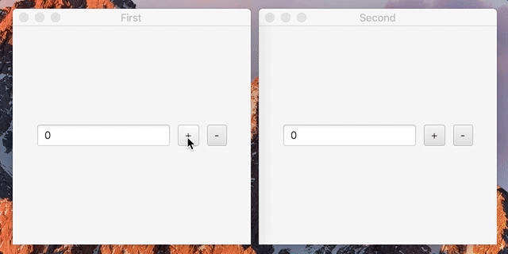

# JavaFX Observer Pattern

## Example



## Compile and run

```bash
# Install ant on macOS
brew install ant

# Create and run jar file
ant

# Cleanup output directory and create jar file
ant clean-build
```
